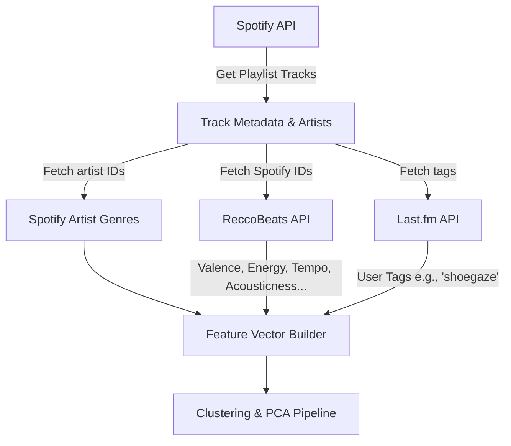
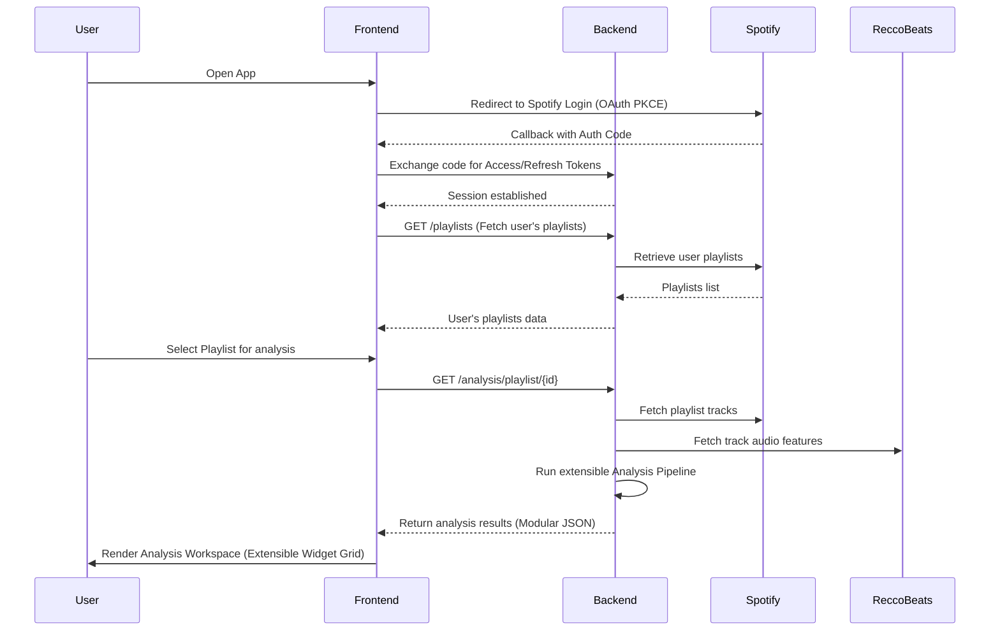
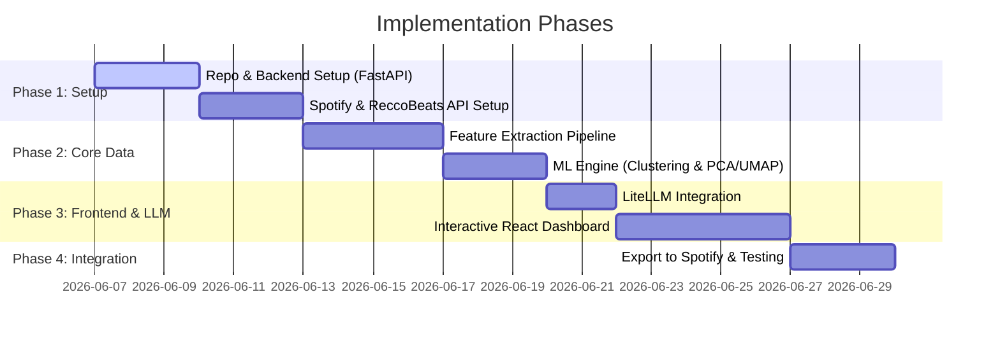

# Specification: Spotify Playlist Vibe Analyzer & Splitter (Spec-1)

## 1. Overview
The **Spotify Playlist Vibe Analyzer & Splitter** is a web application designed to help users clean up and organize their Spotify playlists. Playlists often become cluttered with music of contrasting styles (e.g., shoegaze mixed with bubblegum pop). This tool analyzes the "vibe" (audio features, genres, metadata tags) of songs in a playlist, clusters them using machine learning, visualizes them in an interactive 2D space, and offers LLM-powered recommendations for splitting them into cohesive, vibe-matched playlists.

---

## 2. Technical Stack Recommendations

### 2.1 Backend: Python FastAPI (Highly Recommended)
We agree with the selection of **Python FastAPI** for the backend. 
- **Data & ML Integration**: Python is the industry standard for data science. We can directly leverage libraries like `pandas`, `scikit-learn`, `numpy`, and `umap-learn` for feature extraction, scaling, dimensionality reduction (PCA), and clustering.
- **FastAPI Advantages**:
  - Native asynchronous support, which is critical for making concurrent API calls to Spotify and external metadata APIs.
  - Automatic OpenAPI/Swagger documentation generation.
  - Pydantic-based data validation, ensuring clean data interfaces between the frontend and the data analysis pipeline.
  - Seamless integration with `litellm` for modular LLM access.

### 2.2 Frontend: React + Vite + TypeScript (Alternative to Flutter Web)
While **Flutter Web** offers cross-platform capabilities, we strongly recommend **React (using Vite, TypeScript, and Tailwind CSS)** for the following reasons:
1. **Interactive Data Visualizations**: The core of this application is the 2D visualization (PCA/UMAP plot). The React ecosystem has highly mature, performant, and customizable charting libraries (e.g., **Plotly.js**, **D3.js**, or **Recharts**) that support fluid zoom, pan, hover tooltips, and click events. Implementing custom 2D scatter plots with interactive tooltips in Flutter Web is often more cumbersome and less performant.
2. **Web Integrations & Embeds**: Embedding the Spotify Web Playback SDK or Spotify Iframe Players is much cleaner and more native in a React/JS environment than in Flutter's HTML/Canvas wrapper.
3. **Responsive Web Design**: Tailwind CSS provides lightweight, responsive layouts, fast load times, and a highly customizable design system, ensuring a premium "wow-factor" UI.

*However, if you prefer to proceed with **Flutter Web**, we can design the API to return clean JSON formats (like coordinates and cluster IDs) that Flutter can render using libraries like `fl_chart` or custom canvas painters.*

---

## 3. Data Integration & APIs

Since Spotify deprecated its `/v1/audio-features` endpoint in late 2024, we must fetch audio features from alternative sources. We will use the **ReccoBeats API** as our primary audio features provider, combined with Spotify's own metadata for semantic categorizations.



### 3.1 Spotify API (Core Metadata & OAuth)
- **Authentication**: Spotify OAuth 2.0 (Authorization Code Flow with PKCE) to read user playlists and write new split playlists.
- **Endpoints Used**:
  - `GET /v1/me/playlists` (List playlists)
  - `GET /v1/playlists/{playlist_id}/tracks` (Fetch tracks, artists, album info)
  - `GET /v1/artists` (Fetch artist-level genres, which Spotify still exposes and is highly reliable for overall style classification)
  - `POST /v1/users/{user_id}/playlists` (Create new split playlists)
  - `POST /v1/playlists/{playlist_id}/tracks` (Add tracks to new playlists)

### 3.2 ReccoBeats API (Primary Audio Features)
- **Endpoints Used**:
  - `GET https://api.reccobeats.com/v1/audio-features?ids={spotify_track_ids}`
- **Why**: ReccoBeats is designed as a direct drop-in replacement for the deprecated Spotify audio features. It queries a database of tracks by Spotify/ISRC ID and returns the exact set of features: `acousticness`, `danceability`, `energy`, `instrumentalness`, `liveness`, `loudness`, `speechiness`, `tempo`, and `valence`.
- **Optimization**: Supports batch requests (up to 40 tracks at a time), allowing us to fetch features for an entire playlist in just a few API calls.

### 3.3 Last.fm API (Optional Semantic Vibe tags)
- **Endpoint**: `track.getInfo` or `track.getTopTags`.
- **Why**: Returns user-submitted tags (e.g., "shoegaze", "dream pop", "melancholic", "synthpop"). These tags capture the "vibe" and specific genre labels far better than mathematical audio features alone.
- **Cost**: Free (with developer registration).

---

## 4. Data Analysis & Machine Learning Pipeline

To group tracks and project them onto a 2D canvas, the backend will process track features through the following pipeline:

### 4.1 Feature Construction
For each track, we build a feature vector $x$:
- **Continuous Features**: Sourced directly from **ReccoBeats API**:
  - `tempo` (BPM)
  - `energy` (0.0 to 1.0)
  - `valence` (0.0 to 1.0)
  - `acousticness` (0.0 to 1.0)
  - `danceability` (0.0 to 1.0)
  - `instrumentalness` (0.0 to 1.0)
  - `speechiness` (0.0 to 1.0)
- **Categorical Features**: Artist Genres (from Spotify) and/or Last.fm tags. We can use a TF-IDF vectorizer or One-Hot encoding to convert these into numerical dimensions (e.g., keeping the top 50 most frequent genres/tags in the playlist).

### 4.2 Scaling
Since features have different ranges (BPM is 60–200, energy is 0–1, TF-IDF features are 0–1), we apply a **MinMaxScaler** or **StandardScaler** to ensure all dimensions contribute equally to distance computations.

### 4.3 Clustering (Vibe Grouping)
- **K-Means / K-Means++**: Simple and fast. The user can specify the number of clusters (splits) or we can use the **Elbow Method** / **Silhouette Score** to auto-suggest the optimal number of splits.
- **Agglomerative Hierarchical Clustering**: Useful because music genres have a hierarchical nature (e.g., Shoegaze is a subgenre of Indie Rock). This allows presenting a "split tree" where users can decide how fine-grained they want the splits.

### 4.4 Dimensionality Reduction (2D Plotting)
- **PCA (Principal Component Analysis)**: Good for projecting linear relationships and preserving global distance.
- **UMAP / t-SNE**: Excellent for preserving local cluster structures, creating highly defined "vibe islands" on the 2D plot. We recommend UMAP as it is faster and better preserves global layout compared to t-SNE.

---

## 5. LLM Analysis (via LiteLLM)

We will use `litellm` as a unified interface to support multiple LLM providers (e.g., OpenAI, Anthropic, Gemini, or local models like Ollama). 

### 5.1 Config File (`config.yaml`)
```yaml
llm:
  provider: "openai" # "anthropic", "gemini", "ollama", etc.
  model: "gpt-4o-mini"
  api_key_env_var: "OPENAI_API_KEY"
  temperature: 0.3
```

### 5.2 LLM Prompts & Duties
1. **Cluster Summarization**: For each cluster, we pass the LLM metadata about the tracks:
   - Top genres and tags.
   - Average audio features (e.g., "High energy, low valence, average BPM of 140").
   - Representative song titles and artists.
2. **Output Requirements**: The LLM will return a structured JSON response containing:
   - **Playlist Name Suggestion**: A creative title capturing the vibe (e.g., *"Ethereal Dreamscapes"* instead of *"Cluster 1 - Shoegaze"*).
   - **Playlist Description**: A short description for Spotify.
   - **Vibe Summary**: A paragraph explaining why these tracks fit together.
   - **Outliers**: Identify if any track in the cluster is a "vibe outlier" that should be removed entirely.

---

## 6. User Interface Design & User Flows

The user flow is designed to be clean and focused, routing the user from authentication directly to playlist selection and then into a highly modular, interactive analysis workbench.



### 6.1 View 1: Playlist Selector
- **Peruse Playlists**: A beautiful grid showing the user's personal playlists with thumbnail cover arts, playlist names, track counts, and creators.
- **Search & Filters**: Quick text filter to find playlists by name.
- **Select Playlist**: Clicking a playlist initiates the backend analysis pipeline and transitions the user to the Analysis Workbench.

### 6.2 View 2: Analysis Workbench (Extensible Dashboard)
- **Left Panel (Interactive 2D Scatter Plot Widget)**:
  - Visualizes tracks as colored nodes based on their cluster.
  - Hovering over a dot reveals the track title, artist, and album art.
  - Clicking a dot plays a 30-second audio preview and highlights its position in the list.
- **Right Panel (Split Recommendations Widget)**:
  - Dynamic tabs for each proposed new playlist.
  - LLM-generated titles, descriptions, and rationales.
  - List of tracks inside the selected cluster, with individual "Move to other cluster" dropdowns.
- **Bottom Control Bar (Configuration Widget)**:
  - Sliders to adjust the number of splits (clusters).
  - Toggles to weigh features differently (e.g., "Focus more on tempo" vs "Focus more on genre").
  - **"Create Split Playlists on Spotify"** action button, which executes the splitting process on Spotify directly and redirects the user.

---

## 7. Extensibility & Modular Architecture

To ensure the application is easily extensible as it grows (e.g., adding lyric sentiment, tempo distribution, acoustic profiling, decade analysis, or alternative clustering mechanisms), we enforce modularity at both backend and frontend layers:

### 7.1 Backend: Pipeline Processor Pattern
The FastAPI analysis endpoint does not hardcode its calculations. Instead, it utilizes a pipeline of registered **Analysis Processors**. Each processor operates on the tracks/features DataFrame and adds its results to a standardized output dictionary.

```python
class BaseAnalysisProcessor:
    def process(self, tracks_df: pd.DataFrame, features_df: pd.DataFrame) -> dict:
        """Runs a distinct analysis task and returns key-value pairs to append to the payload."""
        raise NotImplementedError

# Core Processors
class DimensionalityReductionProcessor(BaseAnalysisProcessor):
    # Calculates PCA / UMAP coordinates (x, y)
    ...

class VibeClusteringProcessor(BaseAnalysisProcessor):
    # Groups songs into clusters using K-Means or DBSCAN
    ...

class LLMRecommendationProcessor(BaseAnalysisProcessor):
    # Requests creative names/summaries from LiteLLM
    ...

# Future Additions (Easy to register)
class LyricSentimentProcessor(BaseAnalysisProcessor):
    # Analyzes lyrical sentiment & word clouds
    ...

class DecadesDistributionProcessor(BaseAnalysisProcessor):
    # Calculates historical release-year distribution
    ...
```

Adding new analytical features is as simple as subclassing `BaseAnalysisProcessor` and adding it to the pipeline registry.

### 7.2 Frontend: Widget Registry Layout
On the frontend, the Analysis Workbench is built around a **Widget Registry**. Instead of a fixed layout, the workbench renders components dynamically from the analysis payload returned by the backend.

- Each widget component registers itself to handle specific keys in the JSON response payload.
- Layouts can be easily repositioned, tabbed, or customized dynamically using a flexible grid context (e.g., Tailwind CSS Grid).
- **Adding a new metric/visualization**: Simply build the new component (e.g., `<LyricsSentimentCloud data={data.sentiment} />`) and register it. If the backend omits the data key, the dashboard hides the widget gracefully.

---

## 8. Next Steps & Implementation Roadmap



1. **Verify API Credentials**: Create a Spotify Developer Application and register credentials. Set up a ReccoBeats API account and an optional Last.fm API account.
2. **Initialize Backend**: Setup FastAPI with a basic endpoint to fetch and parse Spotify playlists.
3. **Build the Clustering Module**: Write a python script using `scikit-learn` to test clustering on an example playlist.
4. **Initialize Frontend**: Build the React + Vite dashboard and integrate a plotting library (e.g., Plotly.js).
