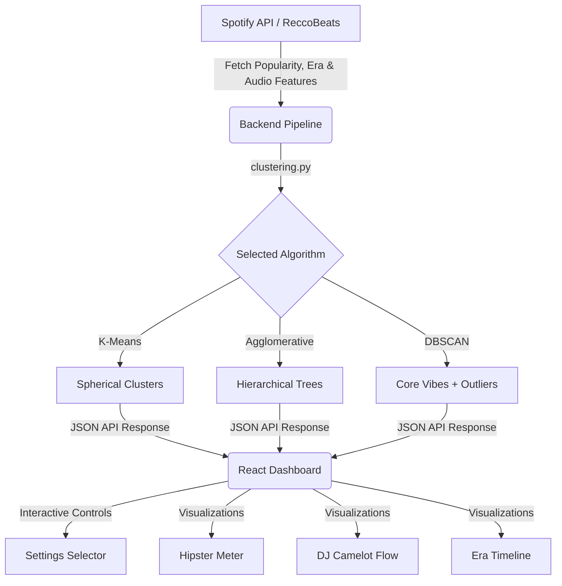

# Project TODO: Advanced Analysis & Clustering Features

Welcome to the feature enhancement board. This directory contains detailed specifications and tasks for adding advanced visualizations and configurable clustering algorithms to the Spotify Playlist Vibe Analyzer.

## Files in this Directory

1. **[README_algorithms.md](file:///c:/src/spotify-analysis/docs/todo/README_algorithms.md)**: Specifications for K-Means, Agglomerative, and DBSCAN clustering, including outlier/wildcard grouping.
2. **[README_analysis.md](file:///c:/src/spotify-analysis/docs/todo/README_analysis.md)**: Layout, logic, and design guides for the Hipster Meter, DJ Deck/Camelot Wheel, and Era Timeline widgets.

## Overview of Implementation Plan

## Getting Started

1. Set up the backend changes in `backend/app/analysis/processors/clustering.py`.
2. Update the frontend UI controls in `frontend/src/App.tsx` and create the new widget files.
3. Test using sample playlists and ensure smooth transitions.
